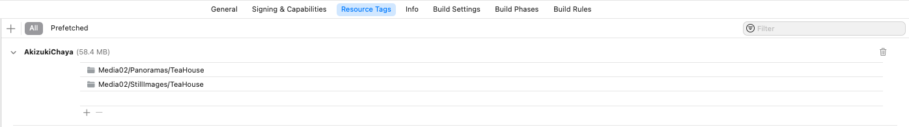

# SwiftUIGamepad

            

`ODRManager` makes it easy to add **On Demand Resource** support to any SwiftUI App and has support for a standardize **Content Loading Overlay** in SwiftUI.

## Overview

By including the `ODRManager` in your app and tagging specific content in your source, you can easily add support for **On Demand Resource** to your SwiftUI App. The `ODRManager` package also includes a standardized **Content Loading Overlay** that you can display while your app is waiting for ODR content to load.

> This package was specifically designed to work with game apps and as a result, requires the `SwiftUIGamepad` package to support gamepad interactions in the built in `ODRContentLoadingOverlay` view.
> 
> If you want to use the `ODRManager` without these additional requirements, just copy the `ODRManager`, `ODRRequest` and `OnDemandResources` directly into your app's project.

### Enabling Gamepad Support

Before you can use a Gamepad in your Swift App, you need to enable support. In Xcode, select your App's **Project** > **Signing & Capabilities** > **+ Capability** and add **Game Controllers**:


Once enabled, select the types of Gamepads that you want to support from the list of checkboxes.

* **Extended Gamepad** - These are game controller like PS4, PS5 and Xbox gamepads. This is the main type of gamepad that the package was designed to support.
* **Micro Gamepad** - This is the Apple TV Siri Remote that can act like a tiny gamepad. 
* **Directional Gamepad** - A small gamepad that has a D-Pad and A & B Buttons only. 

> If you have **Micro Gamepad** enabled, it can keep the Apple TV from recognizing that an **Extended Gamepad** has connected. If you are using this package in a tvOS app, I suggest disabling it.

### Marking Content as ODR

When including content into your app that you want to download later using the `ODRManager`, you'll use Xcode's **On Demand Resource Tag** property to assign an **ODR Tag** to the content. For example, you can mark items in an **Asset Catalog**:


All items with the same **On Demand Resource Tag** will be gathered together and build into an **ODR Package** that the app can later download using the `ODCManager`. In Xcode under your app's **Project** > **Resource Tags** you can see all of the **ODR Packages** and their build sizes:



> For more information on working with **On Demand Resources**, please see Apple's documentation at [https://developer.apple.com/library/archive/documentation/FileManagement/Conceptual/On_Demand_Resources_Guide/index.html#//apple_ref/doc/uid/TP40015083-CH2-SW1](https://developer.apple.com/library/archive/documentation/FileManagement/Conceptual/On_Demand_Resources_Guide/index.html#//apple_ref/doc/uid/TP40015083-CH2-SW1)

### Using the ODRManager

The `ODRManager` makes it easy to request **On Demand Resource** content and react to the content loading or failing to load. Additionally, `ODRManager` makes it easy to pre-request content in the background before it's needed so the end user doesn't have an interruption when using your app. For example:

```
ODRManager.shared.prefetchResourceWith(tag: "Tag01,Tag02,...")
```

If you need to request specific content, use the `requestResourceWith` function. See Example:

```
OnDemandResource.loadResourceTag = "Tag01"
ODRManager.shared.requestResourceWith(tag: OnDemandResource.loadResourceTag, onLoadingResource: {
        Debug.info(subsystem: "MasterDataStore", category: "On Demand Resource", "Loading: \(OnDemandResource.loadResourceTag)")
        OnDemandResource.lastResourceLoadError = ""
        OnDemandResource.isLoadingResouces = true
    }, onSuccess: {
        Debug.info(subsystem: "MasterDataStore", category: "On Demand Resource", "Content Loaded: \(OnDemandResource.loadResourceTagg)")
        OnDemandResource.lastResourceLoadError = ""
        OnDemandResource.isLoadingResouces = false
        
        // Handle load completing ...
    }, onFailure: {error in
        Log.error(subsystem: "MasterDataStore", category: "On Demand Resource", "Error: \(OnDemandResource.loadResourceTag) = \(error)")
        OnDemandResource.lastResourceLoadError = error
        
        // NOTE: Marking `isLoadingResouces` `true` so that the error can be displayed using a `ODRContentLoadingOverlay` in our UI
        OnDemandResource.isLoadingResouces = true
    })
```

#### Displaying the Standard Content Loading Screen

The `ODRContentLoadingOverlay` view can be used as a standardized Content Loading and Loading Error overlay in your app's UI. For example:

```
if OnDemandResource.isLoadingResouces {
	ODRContentLoadingOverlay(onLoadedSuccessfully: {
		// Handle the load completing ...
		OnDemandResource.isLoadingResouces = false
	}, onCancelDownload: {
		// Handle the user wanting to cancel the download ...
		OnDemandResource.isLoadingResouces = false
	})
}
```


#### Release On Demand Resources

To conserve memory, you should release On Demand Resources when you are finished using them. For example:

```
// Release any required resources
ODRManager.shared.releaseResourceWith(tag: "Tag01")
```

Additionally, you'll need to release any failed download attempts so that they can be tried again. For example:

```
// Release any failed resource load attempts so that they can be tried again.
ODRManager.shared.releaseFailedResourceLoads()
```

### Where To Set The Style Changes

For style changes to be in effect, you'll need to make the changes before any `Views` are drawn. You can use the following code on your main app:

```
import SwiftUI
import SwiftletUtilities
import LogManager
import SwiftUIKit
import SwiftUIGamepad
import ODRManager

@main
struct PackageTesterApp: App {
    @UIApplicationDelegateAdaptor private var appDelegate: AppDelegate
    @Environment(\.scenePhase) private var scenePhase
    @Environment(\.colorScheme) var colorScheme
    
    var body: some Scene {
        WindowGroup {
            ContentView()
        }
        .onChange(of: scenePhase) { oldScenePhase, newScenePhase in
            switch newScenePhase {
            case .active:
                Debug.info(subsystem: "PackageTesterApp", category: "Scene Phase", "App is active")
            case .inactive:
                Debug.info(subsystem: "PackageTesterApp", category: "Scene Phase", "App is inactive")
            case .background:
                Debug.info(subsystem: "PackageTesterApp", category: "Scene Phase", "App is in background")
            @unknown default:
                Debug.notice(subsystem: "PackageTesterApp", category: "Scene Phase", "App has entered an unexpected scene: \(oldScenePhase), \(newScenePhase)")
            }
        }
    }
}

/// Class the handle the event that would typically be handled by the Application Delegate so they can be handled in SwiftUI.
class AppDelegate: NSObject, UIApplicationDelegate {
    
    /// Handles the app finishing launching
    /// - Parameter application: The app that has started.
    func applicationDidFinishLaunching(_ application: UIApplication) {
        // Register to receive remote notifications
        UIApplication.shared.registerForRemoteNotifications()
    }
    
    /// Handle the application getting ready to launch
    /// - Parameters:
    ///   - application: The application that is going to launch.
    ///   - launchOptions: Any options being passed to the application at launch time.
    /// - Returns: Returns `True` if the application can launch.
    func application(_ application: UIApplication, willFinishLaunchingWithOptions launchOptions: [UIApplication.LaunchOptionsKey : Any]? = nil) -> Bool {
        // Set any `ODRManager` global style defaults here before any `Views` are drawn.
        // Set style defaults
        OnDemandResource.fontColor = .white
        return true
    }
    
    /// Handles the app receiving a remote notification
    /// - Parameters:
    ///   - application: The app receiving the notifications.
    ///   - userInfo: The info that has been sent to the App.
    func application(_ application: UIApplication, didReceiveRemoteNotification userInfo: [AnyHashable : Any]) {
        
    }
}
```

With this code in place, make any style changes in `func application(_ application: UIApplication, willFinishLaunchingWithOptions launchOptions: [UIApplication.LaunchOptionsKey : Any]? = nil) -> Bool` and they apply to all views built afterwards.

# Documentation

The **Package** includes full **DocC Documentation** for all of Grace's features.
